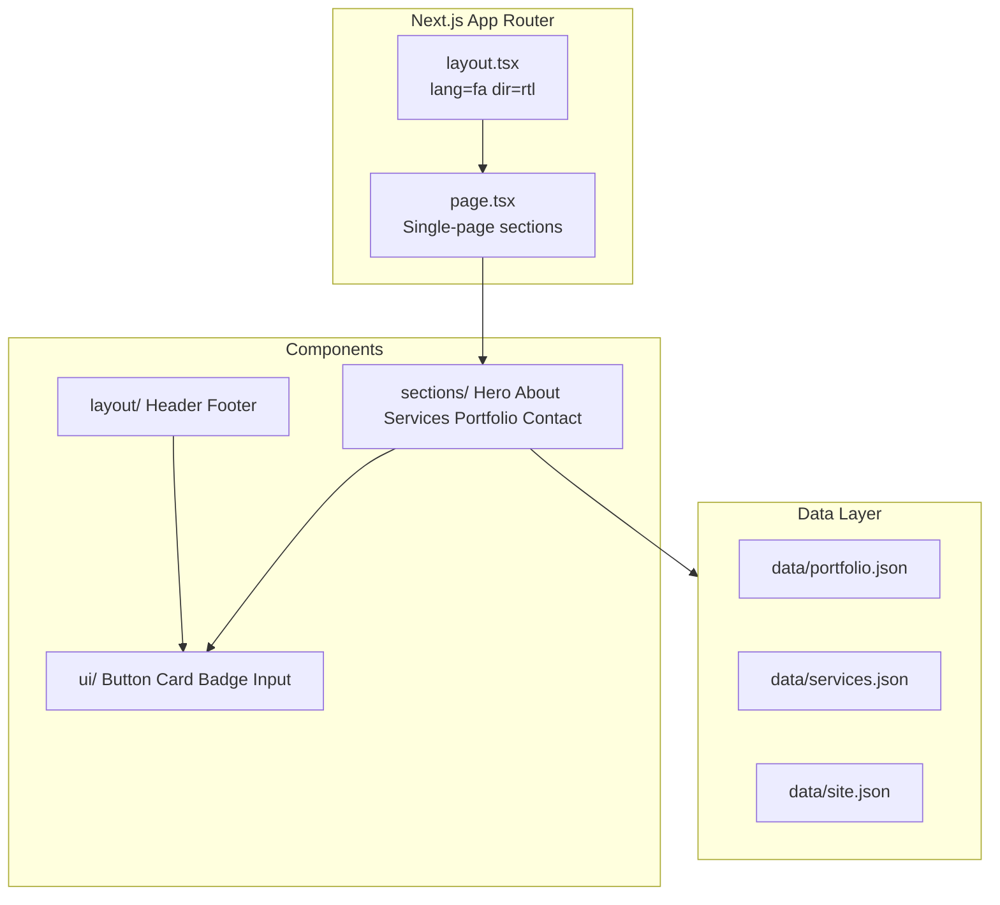

# طرح ساخت RaxinShop (راکسین شاپ)

## Design Read (قبل از کد)

**Reading this as:** corporate/agency landing for Persian B2B audience, with dark glassy premium language, leaning toward Next.js App Router + Motion + Vazirmatn RTL + JSON-driven sections.

**Dials:** `DESIGN_VARIANCE: 9` | `MOTION_INTENSITY: 7` | `VISUAL_DENSITY: 3`

**Skills فعال در این پروژه:**

| Skill | نقش |
|---|---|
| [`design-taste-frontend`](.agents/skills/design-taste-frontend/SKILL.md) | جهت طراحی، Pre-Flight Check، anti-slop |
| [`high-end-visual-design`](.agents/skills/high-end-visual-design/SKILL.md) | ناوبری شیشه‌ای شناور، کارت‌های nested-bezel، micro-motion |
| [`full-output-enforcement`](.agents/skills/full-output-enforcement/SKILL.md) | فایل‌های کامل، بدون placeholder |
| [`image-to-code`](.agents/skills/image-to-code/SKILL.md) | اختیاری: تولید ۶ تصویر section قبل از کد (Hero, About, Services, Portfolio, Contact, Footer) |

**تصمیم‌های پیش‌فرض** (کاربر سؤال را رد کرد):
- مسیر پروژه: پوشه [`raxinshop/`](raxinshop/) در ریشه workspace (جدا از [`.agents/`](.agents/skills/) و [`.cursor/`](.cursor/rules/))
- Accent: **Cyan** (`#22d3ee` / cyan-400) روی پس‌زمینه zinc-950
- Lucide طبق PRD (با `strokeWidth: 1.5` یکسان) — override صریح کاربر

---

## معماری کلی



**فاز ۱:** Single-page با anchor scroll (`#about`, `#services`, `#portfolio`, `#contact`)  
**فاز ۲ (آینده):** مسیرهای جدا در `app/portfolio/[slug]/`, `app/services/[slug]/` بدون بازنویسی data layer

---

## فاز ۱ — Setup و Configuration

**دستور اولیه:**
```bash
cd "f:\VS Code File\Mine Site"
npx create-next-app@latest raxinshop --typescript --tailwind --eslint --app --src-dir --import-alias "@/*"
```

**Dependencies:**
```bash
cd raxinshop
npm install motion lucide-react react-hook-form @hookform/resolvers zod clsx tailwind-merge
```

**فایل‌های کلیدی:**

| فایل | محتوا |
|---|---|
| [`raxinshop/src/app/layout.tsx`](raxinshop/src/app/layout.tsx) | `lang="fa"` `dir="rtl"`, Vazirmatn via `next/font/google`, metadata SEO فارسی |
| [`raxinshop/src/app/globals.css`](raxinshop/src/app/globals.css) | CSS variables: `--background`, `--accent`, `--surface`, grain overlay ثابت |
| [`raxinshop/tailwind.config.ts`](raxinshop/tailwind.config.ts) | فونت، رنگ‌های brand، `fontFamily.vazir` |
| [`raxinshop/src/lib/utils.ts`](raxinshop/src/lib/utils.ts) | `cn()` helper |
| [`raxinshop/src/types/index.ts`](raxinshop/src/types/index.ts) | `PortfolioItem`, `ServiceItem`, `SiteConfig` |

**قوانین RTL (الویت مطلق):**
- `<html lang="fa" dir="rtl">` در root layout
- Tailwind logical: `ms-*`/`me-*`, `ps-*`/`pe-*`, `text-start`, `start-*`/`end-*` — **نه** `ml`/`mr`/`left`/`right`
- Hero و sectionها: `min-h-[100dvh]` نه `h-screen`
- Container: `max-w-7xl mx-auto px-4 md:px-8`

**Design tokens (ثابت در کل سایت):**
- Background: `zinc-950` (#09090b)
- Surface: `zinc-900/50` + glass
- Text: `zinc-100` / body `zinc-400`
- Accent: cyan-400 (CTA، hover، focus ring)
- Radius: buttons `rounded-full`, cards `rounded-2xl` (Shape Consistency Lock)

---

## فاز ۲ — Component Library

ساختار [`raxinshop/src/components/`](raxinshop/src/components/):

### `ui/` (اتم‌ها)
- `Button.tsx` — primary (cyan fill) / ghost / outline؛ `:active scale-[0.98]`
- `Card.tsx` — double-bezel pattern از high-end-visual-design (outer shell + inner core)
- `Badge.tsx` — برای category/tag پورتفolio
- `Input.tsx`, `Textarea.tsx` — با label بالا + error پایین (RTL)
- `SectionHeading.tsx` — عنوان + توضیح؛ **حداکثر ۱ eyebrow در هر ۳ section** (taste rule)
- `Reveal.tsx` — wrapper با `motion` + `whileInView` + `useReducedMotion`

### `layout/`
- `Header.tsx` — sticky floating glass pill (`backdrop-blur-xl`, border white/10, inner highlight)
- `MobileMenu.tsx` — client component؛ hamburger morph + slide panel
- `Footer.tsx` — social links، copyright، لینک‌های سریع

### `hooks/`
- `useScrollSpy.ts` — active nav link بر اساس section visible
- `useMediaQuery.ts` — breakpoint helper

---

## فاز ۳ — Data Layer (مقیاس‌پذیر)

| فایل | محتوا |
|---|---|
| [`raxinshop/src/data/site.json`](raxinshop/src/data/site.json) | نام برند، tagline، social links، contact info |
| [`raxinshop/src/data/services.json`](raxinshop/src/data/services.json) | ۴–۶ خدمت: id, title, description, icon name |
| [`raxinshop/src/data/portfolio.json`](raxinshop/src/data/portfolio.json) | ۴ پروژه mock: id, title, description, image (picsum seed), category |

**Categories نمونه:** `branding` | `web` | `marketing` | `all`

**TypeScript interfaces** در [`raxinshop/src/types/index.ts`](raxinshop/src/types/index.ts) — import در همه sectionها

---

## فاز ۴ — Sections (ترتیب پیاده‌سازی)

### 1. Hero ([`sections/Hero.tsx`](raxinshop/src/components/sections/Hero.tsx))
- Headline فارسی: حداکثر **۲ خط** (taste rule)
- Subtext: ≤ ۲۰ کلمه
- ۲ CTA: «مشاهده نمونه‌کارها» + «تماس با ما»
- پس‌زمینه: mesh gradient ملایم cyan روی zinc-950 (نه purple AI glow)
- المان بصری: abstract glow orb یا editorial image frame
- **بدون** trust strip داخل hero — badges در About

### 2. About ([`sections/About.tsx`](raxinshop/src/components/sections/About.tsx))
- روایت برند + mission/values (۳ value card)
- Trust badges row: ۴ placeholder (سال فعالیت، پروژه، رضایت، گواهی) — اعداد organic نه `99.99%`
- Layout: split asymmetric (text start + visual end در RTL)

### 3. Services ([`sections/Services.tsx`](raxinshop/src/components/sections/Services.tsx))
- Grid: `grid-cols-1 md:grid-cols-2 lg:grid-cols-3` — **نه** ۳ کارت یکسان تکراری
- Card hover: `scale-[1.02]` + border accent glow ملایم
- داده از `services.json`

### 4. Portfolio ([`sections/Portfolio.tsx`](raxinshop/src/components/sections/Portfolio.tsx)) — **Client Component**
- Tab bar فیلتر category با `motion.layoutId` برای underline animated
- Grid masonry-style: `grid-cols-1 md:grid-cols-2` با `AnimatePresence mode="popLayout"`
- هر card: تصویر `next/image` + overlay + category badge
- Filter بدون refresh — `useState` + filter array

### 5. Contact + Footer ([`sections/Contact.tsx`](raxinshop/src/components/sections/Contact.tsx))
- Form: name, email, phone, message
- Validation: **Zod schema** + react-hook-form — خطاهای inline فارسی
- Submit: client-side success state (فاز ۱ بدون API؛ آماده برای `app/api/contact/route.ts` در آینده)
- Footer: social icons (Lucide)، آدرس placeholder، copyright «راکسین شاپ»

### [`raxinshop/src/app/page.tsx`](raxinshop/src/app/page.tsx)
```tsx
// Server Component — import sections
<Header />
<main>
  <Hero />
  <About />
  <Services />
  <Portfolio />
  <Contact />
</main>
<Footer />
```

---

## فاز ۵ — Animation و Polish

**Motion strategy** (client leaf components only):
- Scroll reveal: `Reveal` wrapper — `opacity 0→1`, `y 24→0`, stagger children
- Header: blur/shrink on scroll (`useScroll` + `useTransform`)
- Portfolio filter: `layoutId` tab indicator
- Mobile menu: stagger nav links
- `prefers-reduced-motion`: degrade to static (الزامی)

**Navigation:**
- Desktop: لینک‌های anchor با smooth scroll (`scroll-behavior: smooth` در CSS)
- Mobile: hamburger → full-screen overlay
- Active section highlight via `useScrollSpy`

**Images:**
- Placeholder: `https://picsum.photos/seed/raxin-{keyword}/{w}/{h}`
- Hero + portfolio: `next/image` با `priority` روی hero
- Alt text فارسی معنادار

---

## فاز ۶ — Review و Production Readiness

**Pre-Flight Check** ([design-taste-frontend §14](.agents/skills/design-taste-frontend/SKILL.md)):
- صفر em-dash در copy
- Hero ≤ 2 خط، CTA contrast WCAG AA
- یک accent (cyan) در کل صفحه
- Eyebrow count ≤ ceil(sections/3)
- Navigation یک خط در desktop، ≤ 80px height
- `min-h-[100dvh]` everywhere
- Reduced motion wrapped
- No console.log، no unused imports

**SEO metadata** در layout:
- `title`, `description`, `openGraph` فارسی
- `robots`, `viewport`

**Responsive test viewports:** 375px, 768px, 1280px, 1440px

---

## ساختار نهایی دایرکتوری

```
raxinshop/
├── public/images/
├── src/
│   ├── app/
│   │   ├── layout.tsx
│   │   ├── page.tsx
│   │   └── globals.css
│   ├── components/
│   │   ├── ui/
│   │   ├── layout/
│   │   └── sections/
│   ├── data/
│   │   ├── site.json
│   │   ├── services.json
│   │   └── portfolio.json
│   ├── hooks/
│   ├── lib/utils.ts
│   └── types/index.ts
├── tailwind.config.ts
└── package.json
```

---

## ترتیب اجرا (تأیید مرحله‌ای)

هر فاز پس از اتمام، خلاصه کوتاه + `npm run dev` test به کاربر گزارش می‌شود:

1. **Setup** — scaffold + RTL + fonts + tokens
2. **UI atoms** — Button, Card, Input, Reveal
3. **Layout** — Header, Footer, MobileMenu
4. **Data** — JSON files + types
5. **Sections** — Hero → About → Services → Portfolio → Contact
6. **Polish** — motion, scroll spy, responsive QA
7. **Pre-Flight** — lint, typecheck, final review

---

## ریسک‌ها و mitigation

| ریسک | راه‌حل |
|---|---|
| RTL layout bugs | logical properties + تست manual در devtools |
| Taste skill vs PRD (Lucide, glass) | PRD صریح = Lucide؛ glass با inner border نه slop |
| Over-animation | MOTION 7 not 10؛ reduced-motion mandatory |
| Portfolio filter jank | isolate در client component + `layoutId` |
